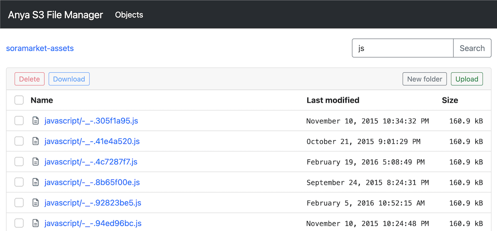

# anya-s3-file-manager
An AWS S3 file manager.  
It supports archive files into a zip then download it.
And supports keyword search, upload, preview video.



## Installation
```bash
git clone https://github.com/kelp404/anya-s3-file-manager.git
cd anya-s3-file-manager
npm install
npm run build
```


## Start
### 1. Update S3 settings.
Open `./config/staging.js` and modify it.
```js
S3: {
	KEY: 'Access key ID',
	SECRET: 'Secret access key',
	BUCKET: 'S3 bucket name',
	REGION: 'us-west-2',
},
```
### 2. Launch the website
The server will listen http://localhost:8000 by default.
```bash
npm start
```


## Amazon S3 pricing
https://aws.amazon.com/s3/pricing/


## Create AWS S3 bucket
anya-s3-file-manager uses Access Key to access your s3, so enable "Block all public access" is ok.  
https://aws.amazon.com/getting-started/hands-on/backup-files-to-amazon-s3/


## Create access key
https://objectivefs.com/howto/how-to-get-amazon-s3-keys

Ths policy example.  
You can set ip whitelist at "aws:SourceIp".
```
{
    "Version": "2012-10-17",
    "Statement": [
        {
            "Effect": "Allow",
            "Action": [
                "s3:*"
            ],
            "Resource": [
                "arn:aws:s3:::your-bucket",
                "arn:aws:s3:::your-bucket/*"
            ],
            "Condition": {
                "ForAnyValue:IpAddress": {
                    "aws:SourceIp": [
                        "0.0.0.0/0"
                    ]
                }
            }
        }
    ]
}
```
